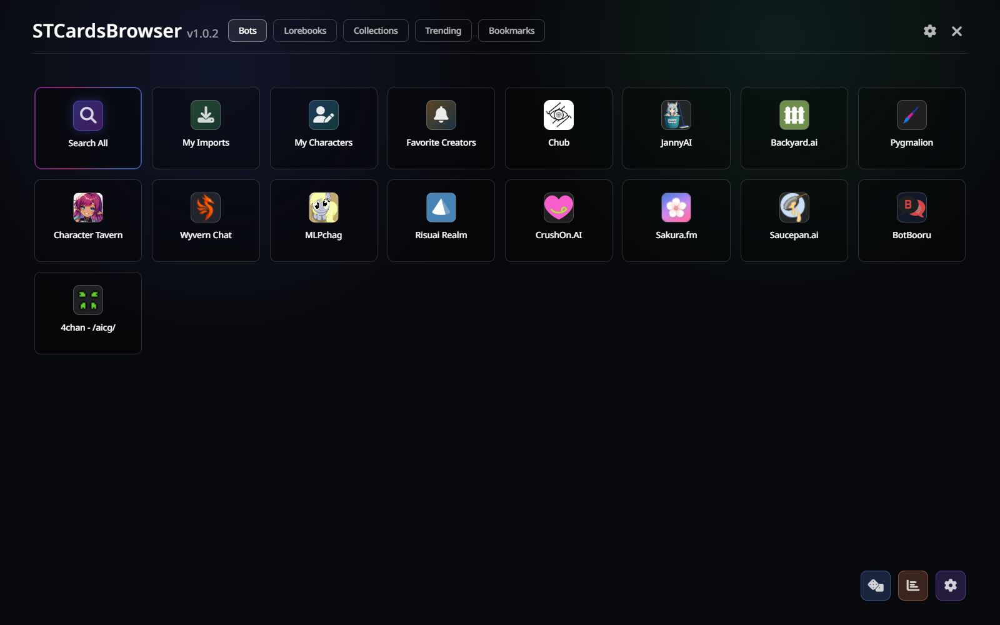
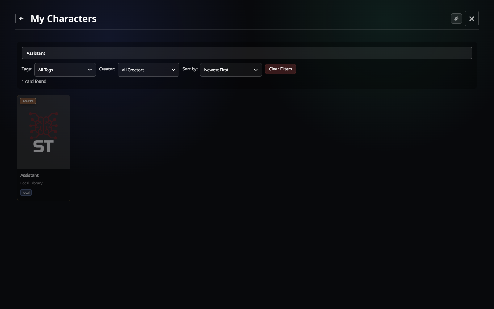
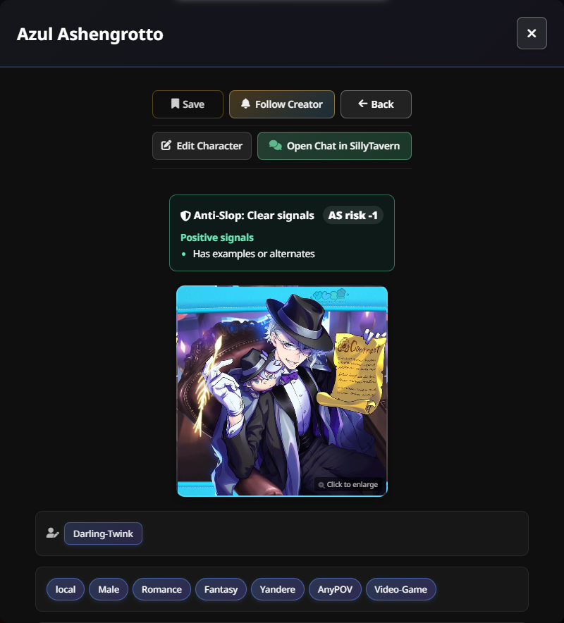
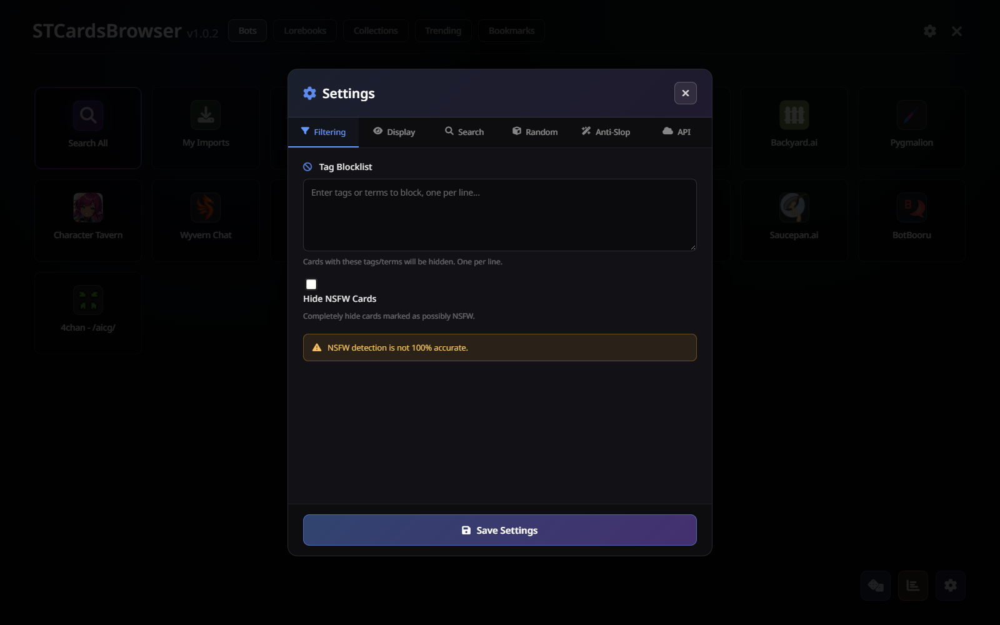

# STCardsBrowser

**STCardsBrowser** is a full-screen card browser for [SillyTavern](https://github.com/SillyTavern/SillyTavern). Discover character cards, lorebooks, collections, trends, and your local library without leaving the app.

> This is an independently maintained fork of BotBrowser. The legacy remote archive/iframe path has been removed. Third-party integrations can change or become unavailable; review the source and use the extension at your own discretion.

## Highlights

- Browse characters, lorebooks, collections, and trends in one full-screen interface.
- Search multiple live sources at once, with source-aware filters and NSFW controls.
- Inspect cards in detail, open galleries and creator information, then import or update characters.
- Keep bookmarks, favorite creators, recently viewed cards, and your local SillyTavern library close at hand.
- Use dedicated views for local characters and World Info, including editors and direct chat navigation.
- Designed for desktop and mobile layouts.

## Screenshots and demos

  

<em>Choose a source, open the local library, or search across supported sources.</em>

  

<em>Search, filter, and sort your local SillyTavern character library.</em>

  

<em>Inspect a card, edit local characters, save it, or open a chat directly.</em>

  

<em>Configure filtering, display, search, randomization, anti-slop, and API behavior.</em>

## Install

1. In SillyTavern, open **Extensions** and install this repository as an extension.
2. Reload SillyTavern.
3. Click the card-browser icon beside the character import controls to open STCardsBrowser.

## What you can browse

| Area | Includes |
| --- | --- |
| Characters | Live sources, Search All, AI Finder, and your local character library |
| Lorebooks | Live lorebook sources and local World Info files |
| Trending | Separate trending feeds from supported services |
| Saved content | Bookmarks, recently viewed cards, and favorite creators |

## Search and safety

- Use **Search All** when the source does not matter.
- Add `+tag` to require a tag or `-tag` to exclude one.
- Apply source-specific filters where available.
- Choose whether to hide NSFW cards, blur NSFW cards, blur all card art, or hide locked definitions.

## Your lorebooks

STCardsBrowser also works with local SillyTavern World Info files.

- Search, sort, and filter local lorebooks.
- Bookmark lorebooks for later.
- Inspect a book and open it in SillyTavern's World Info editor.
- Edit entries in the built-in lorebook editor, including adding and removing entries.

## Favorite creators

Follow a creator from any card's detail view to keep their work in one place. The **Favorite Creators** source aggregates new cards from supported services and can show update notifications when followed creators publish again.

## Anti-Slop signals

Anti-Slop is an optional, explainable quality heuristic—not a verdict on a creator or character. It scores visible card metadata such as definition depth, greetings, examples, tags, source signals, and configured custom rules.

- **Review** identifies cards that cross your warning threshold; you can dim or hide them.
- **Clear** highlights cards with positive signals, such as examples, lorebooks, verified status, or strong engagement.
- Open a card to see the score and the exact warning and positive signals that contributed to it.
- Configure thresholds, source presets, weights, and custom rules under **Settings → Anti-Slop**.

## Supported sources

Available sources can change as third-party services evolve. The extension includes integrations for Chub, JannyAI, Character Tavern, Sakura.fm, Wyvern, CharaVault, Harpy.chat, RisuRealm, Backyard.ai, CrushOn.AI, Botify.ai, Joyland.ai, SpicyChat, Talkie AI, Saucepan.ai, MLPchag, Pygmalion, and selected archive/trending feeds.

## Project layout

See [PROJECT_STRUCTURE.md](PROJECT_STRUCTURE.md) for a maintainer-oriented map of the codebase.

## License

[WTFPL+](LICENSE)
